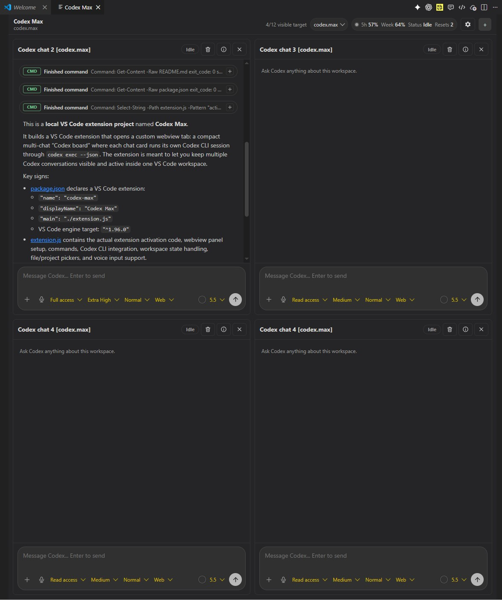

# Codex Max

Codex Max is a local VS Code extension that opens a workspace tab with a compact board of embedded Codex chats. Each card runs its own Codex CLI thread through `codex exec --json`, so several conversations can stay visible at once.

## Screenshot

## Run in VS Code

1. Open this folder in VS Code.
2. Press `F5` to start an Extension Development Host.
3. Run `Codex Max: Open Chat Board` from the Command Palette.
4. Add chats with the `+` button or `Codex Max: Add Chat`.

## Notes

- The extension uses `codex exec --json` for new embedded chats.
- Existing cards resume with `codex exec resume --json <thread_id>`.
- Chat board state is stored in VS Code workspace state.
- The board is tuned for up to 12 visible chat cards on a large editor area.
- Each card has its own title, transcript, model, reasoning effort, verbosity, web search, and filesystem access controls.

## Settings

- `codexMax.codexExecutable`: path or name of the Codex CLI executable.
- `codexMax.grokExecutable`: path or name of the Grok Build CLI executable.
- `codexMax.kiloExecutable`: path or name of the Kilo Code CLI executable.
- `codexMax.defaultSandbox`: `read-only`, `workspace-write`, or `danger-full-access`.
- `codexMax.model`: optional model override.
- `codexMax.maxVisibleChats`: soft visible-card target before the UI warns you.
- `codexMax.chatsPerRow`: default number of chat cards per horizontal row.
- `codexMax.chatsPerColumn`: default number of chat card rows visible vertically.

## Chat Card Controls

- `Model`: optional model id. Leave blank to use your Codex default.
- `Reason`: `minimal`, `low`, `medium`, `high`, or `xhigh`.
- `Voice`: response verbosity.
- `Web`: off, cached search, or live search.
- `Files`: read-only, workspace write, or full access.

## Board Settings

Use the gear button in the Codex Max toolbar to set how many chats are shown horizontally. The value is stored per workspace and can be set from 1 to 12.
You can also set how many chat rows are visible vertically. The value is stored per workspace and can be set from 1 to 6.
Board settings also control chat card height, chat background color, send shortcut behavior, auto-scroll, Codex CLI status, account limits, and voice input.

## Agent Runners

Codex Max normally runs chats through Codex CLI. Board Settings also include `Agent runner`, where you can switch a workspace to `Grok Build CLI` or `Kilo Code CLI`.

- `Codex CLI`: uses `codex exec --json` and the existing Codex/OpenAI login.
- `Grok Build CLI`: uses xAI Grok Build headless mode with `grok -p ... --output-format streaming-json`.
- `Kilo Code CLI`: uses Kilo headless mode with `kilo run --format json --auto --dir <project>`.
- Grok sessions are stored with a `grok-...` session id so they do not collide with Codex thread ids.
- Kilo sessions are stored with a `ses_...` session id and reuse Kilo's own model/provider routing.
- The Grok status card can open install, login, inspect, and version commands in a VS Code terminal.
- The Kilo status card can open install, login, model list, and version commands in a VS Code terminal. Codex Max also auto-detects the bundled Kilo Code VS Code extension binary when `kilo` is not on PATH.
- Install Grok Build with the official xAI installer, then run `grok login` or expose `XAI_API_KEY` to VS Code.
- Install Kilo CLI with `npm install -g @kilocode/cli` or install the Kilo Code VS Code extension, then run `kilo auth login`. Available models are loaded from `kilo models` and shown in the composer model dropdown while Kilo is selected.

## Workspaces

Codex Max has its own workspace switcher in the board toolbar. A Codex Max workspace is a saved board layout with its own chat cards, display settings, selected project folder, and chat state. This lets you keep separate boards for different projects without mixing their conversations.

- Use the workspace dropdown near the visible chat counter to switch between saved workspaces.
- Use `New workspace` to create a fresh board. New workspaces start with four chats in a 2x2 layout.
- Each chat title includes the current project folder name in square brackets, for example `Codex chat 1 [codex.max]`.
- In `Chat information`, `Chat project` is the folder used for that chat, while `Current workspace` is the active VS Code workspace folder. You can choose a project manually or use the current workspace.
- Workspace-specific settings are saved independently, including rows, columns, max chat height, background color, and voice settings.
- The workspace dropdown can export/import all Codex Max workspaces as JSON, including chats, messages, selected projects, and board settings.
- Board Settings can export/import a workspace preset. Presets contain layout, background, send behavior, auto-scroll, voice, and Local Whisper settings, but they do not include chat history.

## Voice Input

Codex Max can insert dictated text into the active chat composer. The microphone button is shown in each chat composer, and a configurable shortcut can toggle voice input for the chat whose input is focused.

Voice input engines:

- `Browser Web Speech`: uses the browser/webview speech API when it is available. It depends on VS Code/webview microphone permissions and the host platform.
- `Local Whisper`: uses local `whisper.cpp` runtime and free GGML Whisper models. Audio is transcribed locally and is not sent to the selected Codex model.
- `Off`: hides voice behavior while keeping normal text input.

Local Whisper supports downloading the runtime and selected model from Board Settings. After selecting a model and clicking `Apply`, Codex Max keeps one persistent Whisper process warm so later voice captures do not need to reload the model every time.
Automatic whisper.cpp runtime installation is platform-aware: Windows x64/Win32 uses the official zip runtime, Linux x64/arm64 uses the official Ubuntu tar.gz runtime, and unsupported platforms show a clear runtime status instead of trying to run Windows-only setup commands. macOS currently needs a manual CLI runtime path because the upstream release asset is an xcframework rather than the CLI binaries Codex Max uses.

Available Local Whisper models include:

- `Whisper tiny q5_1`: smallest and fastest multilingual model.
- `Whisper base q5_1`: balanced small multilingual model.
- `Whisper base q8_0`: a cleaner base model with a larger quantization.
- `Whisper small q5_1`: recommended balanced model for Russian.
- `Whisper small q8_0`: slower than q5_1, often cleaner.
- `Whisper medium q5_0`: larger multilingual model with better recognition but slower startup and transcription.
- `Whisper large-v3 turbo Russian q5_1`: Russian fine-tuned model for better Russian recognition.

Useful voice settings:

- `Voice shortcut`: keyboard shortcut for toggling voice input.
- `Microphone`: selected capture device for Local Whisper. `Default` uses the current Windows recording device.
- `Mic stop delay`: how long Codex Max waits after stopping recording so final words can still be transcribed.
- `Request access`: asks the webview for microphone access when Browser Web Speech is used.
- `Windows settings`: opens Windows microphone privacy settings.

## Event Details

Codex command, file, web, tool, and reasoning events render as compact rows. Click the `+` control on the right to expand full command details, logs, or JSON payloads.
Expanded event rows scroll internally and do not resize other transcript rows. Codex-style markdown file links open the file in VS Code.
